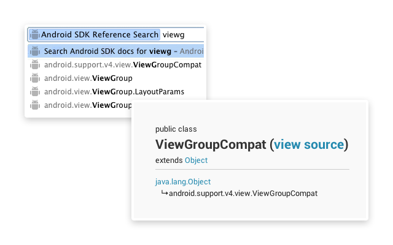

Android SDK Search Extension
============================

A Chrome extension that adds an 'ad' omnibox command and view source links for the Android SDK.

The extension can be downloaded [on the Chrome Web Store](https://chrome.google.com/webstore/detail/android-sdk-search/hgcbffeicehlpmgmnhnkjbjoldkfhoin?hl=en).

